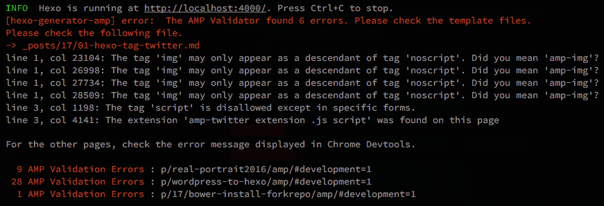

# hexo-generator-amp

AMP ⚡ HTML (Accelerated Mobile Pages Project HTML) generator for [Hexo](https://github.com/hexojs/hexo).


## Orverview

This plugin automatically generates new [AMP HTML](https://www.ampproject.org/docs/get_started/about-amp.html) pages and [validate AMP HTML automaticaly](https://github.com/tea3/hexo-generator-amp#internal-validation-automatically-validate-amp-html).
Output file path is `./your-posts-parmalink/amp/`.  Also, You can [freely cutomize](https://github.com/tea3/hexo-generator-amp#can-i-customize-template-) the template(.ejs) and style(.css). Further , you can also [use caching](https://github.com/tea3/hexo-generator-amp#6-cache-option) to speed up generation time.

## DEMO

First of all, please see the examples. The following is my hexo blog.

- [HTML page](https://tea3.github.io/p/hexo-markdown-notation/) 
- [AMP HTML page (generated by this plugin) ](https://tea3.github.io/p/hexo-markdown-notation/amp/#development=1)

## Installation

``` bash
$ npm install hexo-generator-amp --save
```

## Usage

This is an easy step to publish AMP HTML.

1. [Edit your theme](https://github.com/tea3/hexo-generator-amp#1-edit-your-theme)
2. [Set the quick option](https://github.com/tea3/hexo-generator-amp#2-set-the-quick-option)
3. [Run server](https://github.com/tea3/hexo-generator-amp#3-run-server)
4. [Validate AMP HTML](https://github.com/tea3/hexo-generator-amp#4-validate-amp-html)
5. [Deploy](https://github.com/tea3/hexo-generator-amp#5-deploy)

In addition, the following things are possible.

- [Can I customize template ?](https://github.com/tea3/hexo-generator-amp#can-i-customize-template-)
- [Options](https://github.com/tea3/hexo-generator-amp#options)
- [Front-matter option](https://github.com/tea3/hexo-generator-amp#front-matter-option)
- [Supports external services](https://github.com/tea3/hexo-generator-amp#supports-external-services)

## Simply installation method

To use this plug-in simply , follow the steps below.

### 1. Edit your theme

You must add AMP HTML's link to non-AMP.

> Accelerated Mobile Pages Project - [Prepare Your Page for Discovery and Distribution](https://www.ampproject.org/docs/get_started/create/prepare_for_discovery)

First, add the following in your template files. For example , Please edit `themes/(your-theme)/layout/_partial/head.ejs` as following .

``` ejs
<% if (is_post() && config.generator_amp){ %>
  <link rel="amphtml" href="<%= config.url %>/<%= page.path %>/amp/index.html">
<% } %>
```

Please refer follow as about how to use this plugin with based other templates.

- [jade](https://github.com/tea3/hexo-generator-amp/issues/13)
- [swig](https://github.com/tea3/hexo-generator-amp/issues/14)


### 2. Set the quick option

Please set the following options. Please edit `_config.yml`.

``` yaml
# The following settings is the quick start options.
generator_amp:
  templateDir:  amp-template
  assetDistDir: amp-dist
  logo:
    path:   sample/sample-logo.png
    width:  600
    height: 60
  substituteTitleImage: 
    path:   sample/sample-substituteTitleImage.png
    width:  1024
    height: 800
  warningLog: false   # To AMP HTML validate automatically, please set true.
```

### 3. Run server

Starts a local server. By default, this is at `http://localhost:4000/`.

``` bash
$ hexo server
```

This plugin generated the AMP HTML. Please open `http://localhost:4000/your-posts-parmalink/amp/` in browser.

If occured plugin error , Please refer [#17](https://github.com/tea3/hexo-generator-amp/issues/17) and [other issue](https://github.com/tea3/hexo-generator-amp/issues?q=is%3Aissue+is%3Aclosed) .

### 4. Validate AMP HTML

This plugin generated the AMP HTML. Output file path is `./your-posts-parmalink/amp/`. You should validate AMP HTML .

#### About general validation method

Now validate your AMP HTML. First off all , open your AMP HTML page in [Chrome DevTools](https://developers.google.com/web/tools/chrome-devtools/). The Chrome DevTools console can check for AMP HTML . Second , please Append `http://localhost:4000/your-posts-parmalink/amp/#development=1` to the URL. Please see below for the details.

> Accelerated Mobile Pages Project - [Validate AMP Pages](https://www.ampproject.org/docs/guides/validate.html)

> How to validate AMP - [my blog](https://tea3.github.io/p/how-to-validate-amp/) (Japanese)

#### Internal validation (Automatically validate AMP HTML)

This plugin can validate without being conscious AMP HTML automatically by [amphtml-validator ( AMP HTML validator command line tool )](https://www.npmjs.com/package/amphtml-validator).

To use Internal Validation , please change the `warningLog: true`. 

``` yaml
# Please edit _config.yml.
generator_amp:
  warningLog: true   # To AMP HTML validate automatically,, please set true.
```

For example , when occur the AMP validation error , this plugin displaying following error message .



The content of the message is the same as [AMP Validator](https://validator.ampproject.org/) .

## 5. Deploy

If no AMP HTML Validation error is displayed , verification is complete . Please deploy at the end.

``` bash
$ hexo clean
$ hexo server
$ hexo generate
$ hexo deploy -g
```

When the deployment is completed , Please check the [AMP report](https://support.google.com/webmasters/answer/6328309?hl=en)

## Can I customize template ?

You can freely cutomize the template(.ejs) and style(.css).  Please edit template files included in the `/amp-template/` . Also , template directory can change in the `_config.yml`. 

``` yaml
generator_amp:
  templateDir:  amp-template # Please customize template files included this folder .
```

`amp-template/sample-amp.ejs` and `amp-template/sample-amp.css` is a very simple template , so please customize it as you like . If you have a cool design template please let me know [the issues](https://github.com/tea3/hexo-generator-amp/issues). I would like to introduce your template in this chapter.

## Options

This plugin can set the following options for more detail. Please edit `_config.yml`.

``` yaml
# Advanced Settings of hexo-amp-generator
generator_amp:
  
  # 1. Google Adsense option
  substituteGoogle_adsense:                   #(optional)
    data_ad_client: ca-pub-123456789876543    #(optional)
    data_ad_slot:   0123456789                #(optional)
    width:  336                               #(optional)
    height: 280                               #(optional)
  
  # 2. Template Option
  templateDir:  amp-template
  assetDistDir: amp-dist
  logo:
    path:   sample/sample-logo.png
    width:  600 # width <= 600px
    height: 60  # width <= 60px
  logo_topImage:                              #(optional)
    path:   sample/sample-yoursite-logo.png   #(optional)
    width:  1024                              #(optional)
    height: 400                               #(optional)
  substituteTitleImage: 
    path:   sample/sample-substituteTitleImage.png
    width:  1024 # width >= 696px
    height: 800
  placeholderImg:                             #(optional)
    path: sample/sample-placeholder.png
  cssFilePath:      sample/sample-amp.css     #(optional)
  templateFilePath: sample/sample-amp.ejs     #(optional)
  
  # 3. Google Analytics Option
  google_analytics: UA-123456789-1            #(optional)
  
  # 4. Minify Option
  html_minifier:                              #(optional)
  
  # 5. Log & AMP Validation Option
  warningLog: true                            #(optional)
  
  # 6. Cache Option
  cache: hexo-generator-amp-cached.json       #(optional)
  # onlyForDeploy: false                      #(optional) #Deprecated <= v1.0.3

# 7. Footer Option (authorDetail)
authorDetail:
  authorReading: Your name description        #(optional)
  avatar:                                     #(optional)
    path:   sample/sample-avator.png          #(optional)
    width:  150                               #(optional)
    height: 150                               #(optional)
  description: Self introduction              #(optional)
copyright_notice: The footer copyright notice #(optional)
```


### A description of the options

Option can use as follows.

#### 1. Google Adsense Option

If an advertisement is found in an article, it will be converted to AMP specification.

Adout Google Adsense , please see [Create an AMP ad unit](https://support.google.com/adsense/answer/7183212?hl=en) for the details.

| option | description |
| :---: | :--- |
| data_ad_client | substitute data_ad_client id |
| data_ad_slot | substitute data_ad_slot id |
| width | substitute ad width |
| height | substitute ad height |

#### 2. Template Option

##### templateDir & assetDistDir

| option | description |
| :---: | :--- |
|**templateDir**|File path of a your AMP template files.|
|**assetDistDir**|File path of a your public AMP Assets.|

##### logo

`logo` use for [AMP with structured data](https://developers.google.com/search/docs/data-types/articles) .

| option | description |
| :---: | :--- |
|**path**|File path of a your logo (schema.org logo for AMP) image.|
|**width**|Width of a your logo (schema.org logo for AMP) image. ([width <= 600px](https://developers.google.com/search/docs/data-types/articles#logo-guidelines))|
|**height**|Height of a your logo (schema.org logo for AMP) image. ([height <= 60px](https://developers.google.com/search/docs/data-types/articles#logo-guidelines))|

##### logo_topImage

| option | description |
| :---: | :--- |
|path|File path of a your site logo image.|
|width|Width of a your site logo image.|
|height|Height of a your site logo image.|

##### substituteTitleImage

`substituteTitleImage` use for [AMP with structured data](https://developers.google.com/search/docs/data-types/articles) .

This plugin search automaticaly the information that the AMP carousel need for [structured data](https://developers.google.com/search/docs/data-types/articles)([schema.org/BlogPosting](https://schema.org/BlogPosting)).

However, if an [image that use for schema.org/BlogPosting](https://schema.org/BlogPosting) can not be found in content , this  substitute image is used.

| option | description |
| :---: | :--- |
|**path**|File path of a your substitute title image. (Use this when the image is not in the markdown)|
|**width**|Width of a your substitute title image. ([width >= 696px](https://developers.google.com/search/docs/data-types/articles#article_types))|
|**height**|Height of a your substitute title image.|

##### placeholderImg

This option is the image path used in `<amp-iframe>`'s placeholder. Please see [ampproject/amp-iframe](https://www.ampproject.org/ja/docs/reference/components/amp-iframe) for the detial.

| option | description |
| :---: | :--- |
|**path**| File path of a your placeholder image. |

##### cssFilePath & templateFilePath

| option | description |
| :---: | :--- |
|cssFilePath|File path of a your css file for AMP. (e.g. ./sample-amp.css) [It is a validation error if the author stylesheet is larger than 50,000 bytes.](https://github.com/ampproject/amphtml/blob/master/spec/amp-html-format.md#maximum-size)|
|templateFilePath|File path of a your template file for AMP. (e.g. ./sample-amp.ejs)|


#### 3. Google Analytics Option

| option | description |
| :---: | :--- |
|google_analytics|Your google analytics tracking ID.|

#### 4. Minify Option

| option | description |
| :---: | :--- |
|html_minifier|Enabled html_minifier. Please see [kangax/html-minifier](https://github.com/kangax/html-minifier) for the details.|

#### 5. Log & Auto Validation Option 

| option | description |
| :---: | :--- |
|warningLog| Enabled warnings and AMP HTML Validation . |

#### 6. Cache Option

This option improves the generation speed. Old articles will not be generated AMP HTML again and skip AMP HTML Validation . Old articles will use cache.

| option | description |
| :---: | :--- |
|cache| Enabled cache |

#### 7. Footer Option (authorDetail)

This option use for sample template for AMP HTML.

##### authorReading

| option | description |
| :---: | :--- |
|authorReading|Your name description.|

##### avatar

| option | description |
| :---: | :--- |
|path|File path of a your avator image.|
|width|Width of a your avator image.|
|height|Height of a your avator image.|

##### description

| option | description |
| :---: | :--- |
|description|Self introduction.|

##### copyright_notice

| option | description |
| :---: | :--- |
|copyright_notice|The footer copyright notice.|


## Front-matter option.

This plugin search automaticaly the information that the AMP carousel need for [structured data](https://developers.google.com/search/docs/data-types/articles)([schema.org/BlogPosting](https://schema.org/BlogPosting))

But you can also specify information for each article.

### ampSettings.titleImage.path (optional)

You can choose URL of [image in BlogPosting(schema.org)](https://schema.org/BlogPosting) on a per post. If post is not contain this option , this plugin search the first image's URL from the content.

For example : `hello-world.md` , Please set the following options.

``` markdown
---
title: Hello World
ampSettings: 
 titleImage:
   path: titleImage-on-the-local-folder.png
---

Welcome to [Hexo](https://hexo.io/)! This is your very first post. 
...

```

If image on the external , Please set the width and height options.

``` markdown
---
title: Hello World
ampSettings: 
 titleImage:
   path: http://titleImage-on-the-external.png
   width: 1024
   height: 800
---

Welcome to [Hexo](https://hexo.io/)! This is your very first post. 
...

```

## Supports external services

Supports the following external services.

- [Twitter (amp-twitter)](https://www.ampproject.org/pt_br/docs/reference/components/amp-twitter) for [hexo-tag-twitter](https://github.com/tea3/hexo-tag-twitter)
- [Youtube (amp-youtube)](https://www.ampproject.org/docs/reference/components/amp-youtube)
- [Vimeo (amp-vimeo)](https://www.ampproject.org/docs/reference/components/amp-vimeo)
- [Instagram (amp-instagram)](https://www.ampproject.org/ja/docs/reference/components/amp-instagram) for [hexo-tag-instagram](https://github.com/tea3/hexo-tag-instagram)
- [Google Adsense (amp-ad)](https://www.ampproject.org/docs/reference/components/amp-ad)
- [Sound Cloud (amp-soundcloud)](https://www.ampproject.org/docs/reference/components/amp-soundcloud) for [hexo-tag-soundcloud](https://github.com/tea3/hexo-tag-soundcloud)

In addition to the above, the embedded `<iframe>` tag is converted to [<amp-iframe>](https://www.ampproject.org/docs/guides/iframes) tag.

If you want to supports other services , please [add new filter](https://github.com/tea3/hexo-generator-amp/tree/master/lib/filter) and [give me pull request](https://github.com/tea3/hexo-generator-amp/pulls) .


## License

MIT

[Hexo]: http://hexo.io/